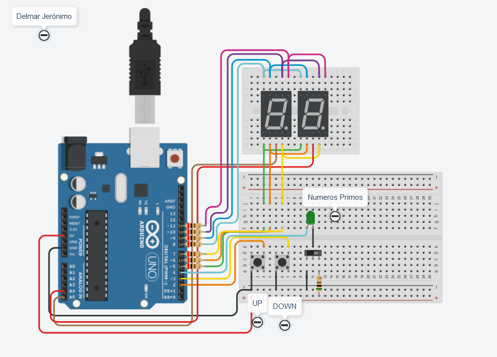
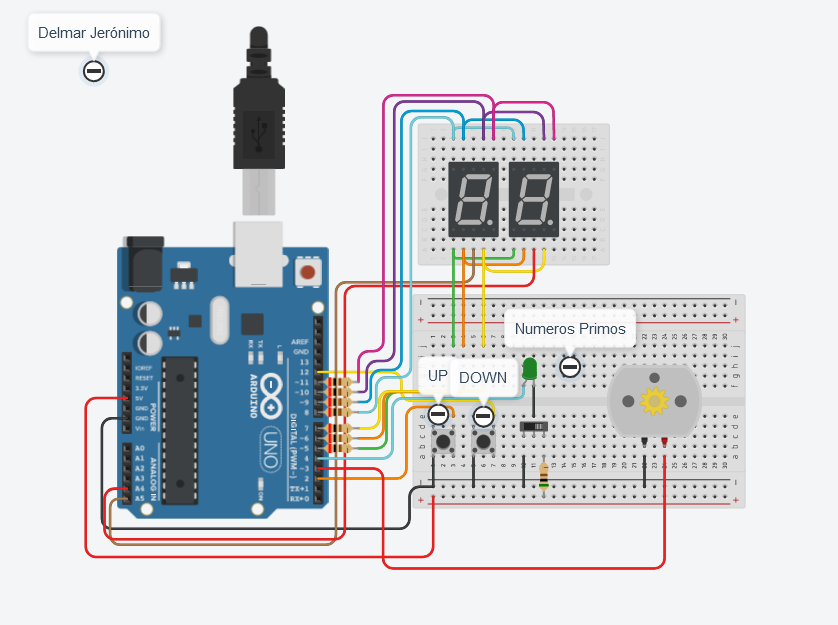

# Parcial 1 - SPD - Comision 1
---
## Integrantes:
- Jerónimo Delmar

---

## Descripción:
#### Parte 1 y 2:
A esta 1era parte le corresponde el archivo **code.c++**.

El dispositivo debe contar con 2 botones y 1 slider, y 2 displays de 7 segmentos. Uno de los botones debe sumar **1** a un contador interno, y el otro debe restar **1**. El slider debe alternar entre 2 modalidades: números primos, y modalidad normal.

Si al llegar a 99 se suma 1 más al contador, el mismo vuelve a 00. Si al estar en 00 se resta 1, el contador pasa a 99.
En el modo *primos* los displays sólo muestran aquellos números que son primos, quedando apagados si el número en lo contadores internos componen un número no primo.

El dispositivo cuenta con un led conectado en serie con el slider, sirviendo de señal visual lumínica que indica cuándo está en modo de números primos (encendido) y cuándo no (apagado).

Los 3 inputs son los pines 2 (UP), 3 (DOWN), y 4 (SLIDER + LED), los cuales están conectados en modo *input pullup*.
Los 2 displays poseen el *Common* como cátodo, y sus pines son A4 (unidades) y A5 (decenas).

**Los pines de los displays son:**

- A = 10
- B = 11
- C = 7
- D = 6
- E = 5
- F = 9
- G = 8

---

# Implementación de Motor DC
A esta segunda parte le corresponde el archivo **code2.c++**.

Se hizo una redefinición de los pines debido a la incorporación de un motor DC.
El pin 3 pasó a ser el del *MOTOR*, mientras que el del botón *DOWN* pasó a ser el pin 12.

Se agregó un cambio en la línea 127, seteándose la potencia de salida del pin que tiene capacidades analógicas acorde con el número del contador, pero multiplicado por 2 (para que sea sensible y notoria la velocidad).

