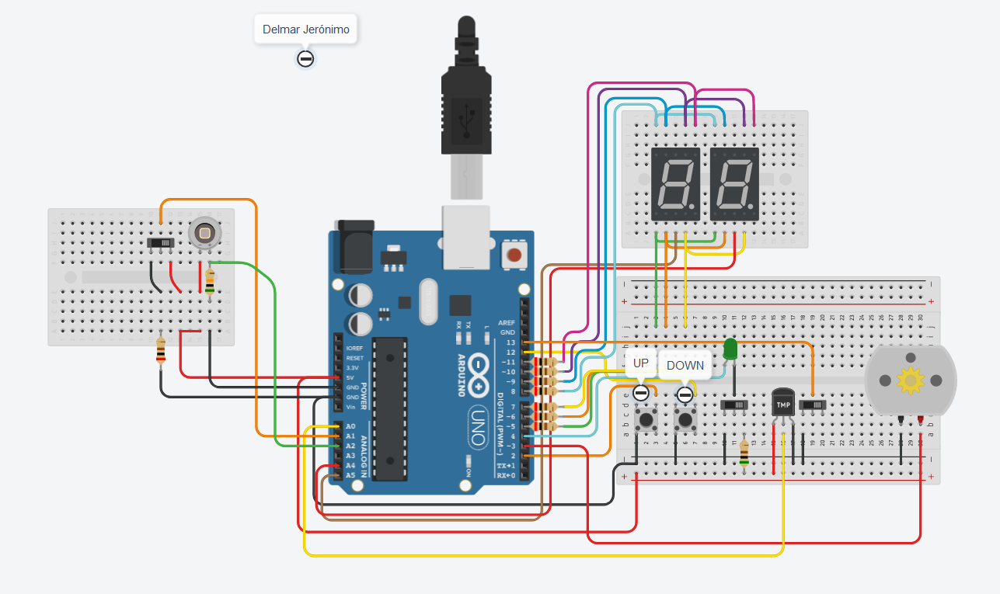

# Parcial 1 - SPD - Comision 1
---
## Integrantes:
- Jerónimo Delmar

---
# Proyecto de Tinkercad:

[Link al proyecto de Tinkercad](https://www.tinkercad.com/things/bqALo3Iiko9-delmar-jeronimo-parcial-domiciliario-p2/editel?sharecode=yWJ8hoOD7c1nIFOCR92Y1h-raNu0vUHg5mru-aTvlU8)

---

## Descripción:
#### Parte 1 y 2:
A esta 1era parte le corresponde el archivo **code.c++**.

El dispositivo debe contar con 2 botones y 1 slider, y 2 displays de 7 segmentos. Uno de los botones debe sumar **1** a un contador interno, y el otro debe restar **1**. El slider debe alternar entre 2 modalidades: números primos, y modalidad normal.

Si al llegar a 99 se suma 1 más al contador, el mismo vuelve a 00. Si al estar en 00 se resta 1, el contador pasa a 99.
En el modo *primos* los displays sólo muestran aquellos números que son primos, quedando apagados si el número en lo contadores internos componen un número no primo.

El dispositivo cuenta con un led conectado en serie con el slider, sirviendo de señal visual lumínica que indica cuándo está en modo de números primos (encendido) y cuándo no (apagado).

Los 3 inputs son los pines 2 (UP), 3 (DOWN), y 4 (SLIDER + LED), los cuales están conectados en modo *input pullup*.
Los 2 displays poseen el *Common* como cátodo, y sus pines son A4 (unidades) y A5 (decenas).

**Los pines de los displays son:**

- A = 10
- B = 11
- C = 7
- D = 6
- E = 5
- F = 9
- G = 8

---

# Implementación de Motor DC
A esta segunda parte le corresponde el archivo **code2.c++**.

Se hizo una redefinición de los pines debido a la incorporación de un motor DC.
El pin 3 pasó a ser el del *MOTOR*, mientras que el del botón *DOWN* pasó a ser el pin 12.

Se agregó un cambio en la línea 127, seteándose la potencia de salida del pin que tiene capacidades analógicas acorde con el número del contador, pero multiplicado por 2 (para que sea sensible y notoria la velocidad).

### Detalles del componente:
El dispositivo implementado es un motor de corriente contínua, el cual consiste en el mecanismo inverso a un generador eléctrico.
El motor está rodeado por dos imanes que generan un campo magnético constante. En su interior se encuentra el rotor, rodeado por bobinados de cobre con 2 terminales cada uno. Las terminales hacen contacto con 2 piezas de carbón, conectadas a los pines del motor.
Cuando una corriente eléctrica corre de un pin al otro, pasa a través de la pieza de carbón al la 1er terminal del bobinado. Al correr por el bobinado hacia la segunda genera un campo magnético, el cual se alineará en relación al campo permanente generado por los imanes. Al hacer esto, girará y alternará las terminales y su contacto con las piezas o escobillas de carbón; si hay sólo 1 bobinado, el campo magnético se revertirá, haciendo que el motor vuelva a girar. En caso de haber varios bobinados, el efecto ocurrirá con el siguiente, continuando con el empuje. El ciclo se repetirá, haciendo que el rotor gire hasta que la corriente eléctrica deje circular.

---

# Implementación de TMP36 (medidor de temperatura)

A esta tercera parte le corresponde el archivo **code3.c++**.

Se agregó un slider en el pin13, configurado como *INPUT PULLUP*, y el componente TMP36 con su pin vOUT (el del medio) conectado al pin A0, para su lectura.

Se movió el código previo a una sección de *else*, poniendo en 1er lugar, en el *if*, a la lectura del nuevo slider.
**Si el slider nuevo se encuentra en LOW, entonces el conjunto entrará en modo de lectura de temperatura**, en el cual se ejecuta el contenido del *if* en el **loop** y se procede a la lectura del pin A0 y a la aplicación de una ecuación para poder estimar la temperatura aproximada que está experimentando el componente.
**Sólo si el slider de temperatura se encuentra en HIGH se podrá acceder a la función de primos.**

El motor DC agregado en el paso anterior se supedita entonces a la lectura de temperatura, la cual también es mostrada mediante el display doble de 7 segmentos.
Si la temperatura supera los 99 grados o pasa por debajo de los 00, tanto el display como el motor se apagan, volviendo a encenderse cuando la temperatura retorna al rango 00-99.

#### [ Extra ]:
**Se agregó una función anti-bumping** a fin de evitar que, al mantener cualquiera de los botones apretados, el contador siga subiendo o bajando. Ahora es necesario que la función principal **loop()** haga 1 revolución sin ningún botón apretado para que la bandera se resetee y el contador vuelva a responder.
Aunque este mecanismo podría ser opcional, en la placa Arduino quedan sólo 3 pines libres, por lo cual se descartó la opcionalidad del mecanismo.

---

# Implementación de FOTODIODO

A esta cuarta parte, que corresponde a la parte 3 del parcial domiciliario, le corresponde el archivo **code4.c++**.

Se agregó un slider en el pin A1.

Se agregó un fotodiodo conectado de forma inversa al pin A2, y una resistencia de 50k-ohms en modo pull-up entre el pin A2 y el GND.

*El fotodiodo produce una corriente eléctrica cuando es expuesto a la luz. Dicha corriente eléctrica posee una tensión que va hasta aproximadamente 0.45mV.*

Se modificó el código para que la medición de luz tenga precedencia sobre las otras modalidades.
Se mapeó el valor recibido por A2 de 49 a 1023 a un rango de 00 a 99, que luego se muestra por los displays.

---

# Función significativa

    void SetLeds(int counter, int option)
    {
        int displayToShow; // Si el valor de 'counter' es 1...
        if (counter == 1)
        {
            switch (option)
            {
                case 1:
                    displayToShow = tempUnits;
                    break;        
                case 2:
                    displayToShow = units; // ... se toma el valor de las unidades.
                    break;
                case 3:
                    displayToShow = lightUnits;
                    break;
            }        
        }
        else
        {        
            switch (option)
            {
                case 1:
                    displayToShow = tempTens;
                    break;        
                case 2:
                    displayToShow = tens; // ... se toma el valor de las unidades.
                    break;
                case 3:
                    displayToShow = lightTens;
            }
        }

        // Arrays con los estados HIGH/LOW correspondientes a los segmentos {A, B, C, D, E, F, G};
        int v0[] = {1, 1, 1, 1, 1, 1, 0}; // 0
        int v1[] = {0, 1, 1, 0, 0, 0, 0}; // 1
        int v2[] = {1, 1, 0, 1, 1, 0, 1}; // 2
        int v3[] = {1, 1, 1, 1, 0, 0, 1}; // 3
        int v4[] = {0, 1, 1, 0, 0, 1, 1}; // 4
        int v5[] = {1, 0, 1, 1, 0, 1, 1}; // 5
        int v6[] = {1, 0, 1, 1, 1, 1, 1}; // 6
        int v7[] = {1, 1, 1, 0, 0, 0, 0}; // 7
        int v8[] = {1, 1, 1, 1, 1, 1, 1}; // 8
        int v9[] = {1, 1, 1, 1, 0, 1, 1}; // 9

        switch (displayToShow) // En base al valor unitario a mostrar se le pasa a LedSetter el array correspondiente.
        {
        case 0:
            LedSetter(v0);
            break;
        case 1:
            LedSetter(v1);
            break;
        case 2:
            LedSetter(v2);
            break;
        case 3:
            LedSetter(v3);
            break;
        case 4:
            LedSetter(v4);
            break;
        case 5:
            LedSetter(v5);
            break;
        case 6:
            LedSetter(v6);
            break;
        case 7:
            LedSetter(v7);
            break;
        case 8:
            LedSetter(v8);
            break;
        case 9:
            LedSetter(v9);
            break;
        }
    }

Una de las funciones más importantes del código. Está encargada de controlar los números que se ven en los displays en conjunto con la función **LedSetter( int[] )** (la cual itera por todos los pines definidos como los pines para los segmentos led y, en base al valor HIGH o LOW recibido para el pin, los setea).
En base al parámetro *int counter* recibido trabajará con la variable global de unidades o decenas del modo correspondiente, y en base al parámetro *int option* alternará entre números, luz, y temperatura.